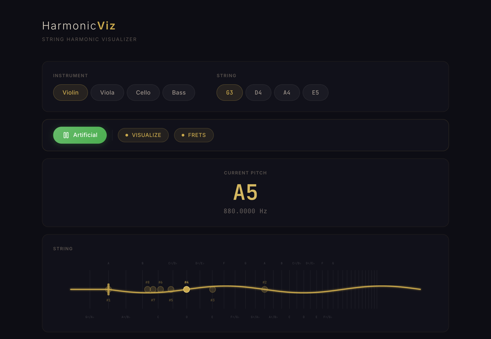
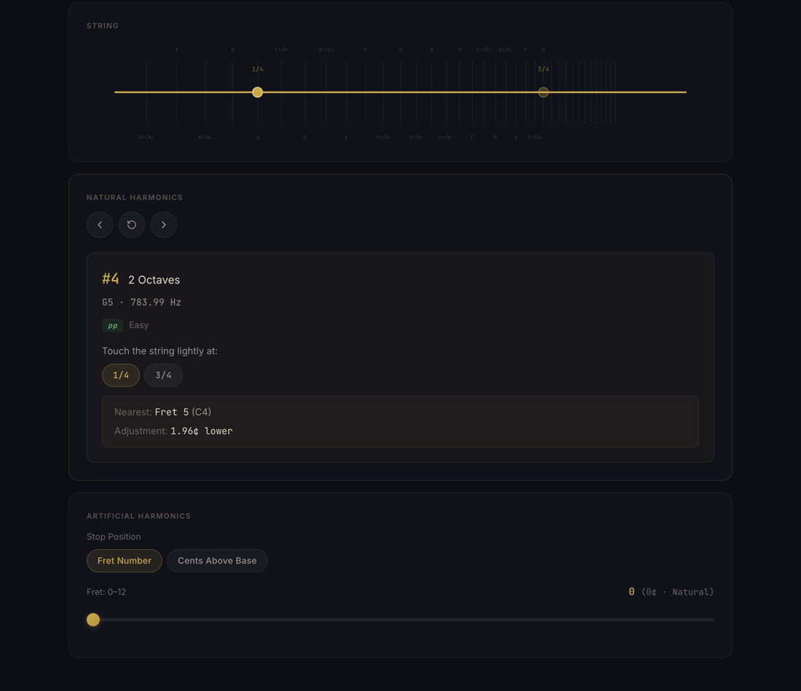

# HarmonicViz

An interactive guide to string harmonics for violin, viola, cello and double bass. Pick a string and a harmonic, and it shows where to touch the string, how far that point is from the nearest semitone position (in cents), and the pitch that sounds.

**Live app:** https://mzhao1599.github.io/harmonicviz/

<p align="center">
  
</p>

## Why

Harmonics are hard to learn from a chart. The touch point for a natural harmonic sits at a simple fraction of the string (1/2, 1/3, 1/4, ...), but those points do not line up with where the fingers normally go, and some are a few cents away from a normal note position. Artificial harmonics add a second step: stop the string with one finger, then lightly touch a node of the *shortened* string with another. HarmonicViz draws all of this to scale on the string and plays the result.

## What it does

- **Instruments and strings.** Violin (G3 D4 A4 E5), viola (C3 G3 D4 A4), cello (C2 G2 D3 A3) and double bass (E1 A1 D2 G2), tuned from A4 = 440 Hz.
- **Natural harmonics #1–#16.** For each one: the interval above the open string ("2 Octaves + Major Third"), the sounding note and frequency, a rough difficulty rating, and every touch point that produces that harmonic. Choosing a touch point shows the nearest semitone position and how many cents higher or lower the true node is.
- **Artificial harmonics.** A slider sets where the lower finger stops the string (semitone positions 0–12, or any point from 0 to 1200 cents). The app lists harmonics #1–#8 of the stopped note and where to touch for each. #4 is the usual "touch a fourth above" harmonic (two octaves up) and #3 is "touch a fifth above".
- **String drawing.** An SVG of the string drawn to scale, with semitone positions marked, clickable harmonic nodes, and an optional animated standing wave. In artificial mode only the part between the finger and the bridge vibrates.
- **Playback.** Plays the sounding pitch as a sine tone.

<p align="center">
  
</p>

## The math

Everything comes from an ideal string of length *L* whose open pitch is *f₀*. Positions are measured from the nut.

| Quantity | Formula | Code (`src/App.tsx`) |
|---|---|---|
| Open-string pitch | f₀ = 440 · 2^(semitones from A4 / 12) | `calculateFrequencyFromA440` |
| Natural harmonic *n* | fₙ = n · f₀ | `playNote` |
| Touch points for harmonic *n* | x = (i/n) · L for every i < n with gcd(i, n) = 1 | `getHarmonicPositions` |
| Semitone position *k* | x = (1 − 2^(−k/12)) · L | `getPositionInfo` |
| Offset from semitone position *k* | 1200 · log₂((L − x_k) / (L − x)) cents | `getPositionInfo` |
| Stopped note, *c* cents above open | f_s = f₀ · 2^(c/1200), stopped at x_s = (1 − 2^(−c/1200)) · L | `calculateArtificialHarmonics`, `getStopPosition` |
| Artificial touch point for harmonic *n* | x_s + (L − x_s)/n, sounding n · f_s | `calculateArtificialHarmonics` |

The gcd filter matters: touching at 2/4 of the string gives the 2nd harmonic, not the 4th, so each harmonic lists only the fractions in lowest terms. The cents readouts are what make the app useful for practice. On the violin G string, the 1/4 node is 1.96 cents below the 5th semitone position (C4). On any string, the 5th harmonic (a pure major third, two octaves up) sounds 13.69 cents below its equal-tempered note.

## How it is built

- **React 19 + TypeScript + Vite 7.** The app is one component, [`src/App.tsx`](src/App.tsx), styled by [`src/App.css`](src/App.css).
- **Rendering.** Plain SVG. The standing wave is 100 line segments of height `8 · sin(π·n·x) · sin(phase)`, with the phase advanced on a 16 ms timer.
- **Audio.** The Web Audio API directly: one sine `OscillatorNode` through a `GainNode`. No audio library.
- **Deployment.** `npm run deploy` builds with `base: '/harmonicviz/'` and pushes `dist/` to the `gh-pages` branch, which GitHub Pages serves.

## Run it locally

Requires Node 20.19 or newer (Vite 7).

```bash
git clone https://github.com/mzhao1599/harmonicviz && cd harmonicviz
npm ci
npm run dev        # http://localhost:5173/harmonicviz/
npm run build      # type-check, then build into dist/
```

## Limitations

- The tone is a pure sine wave. It gives the right pitch but does not sound like a bowed string.
- The marker lines are equal-tempered semitone positions. Bowed strings have no frets; the app says "fret" to mean "where that semitone is stopped".
- For each artificial harmonic the app shows only the node nearest the stopping finger, which is the one players use.
- Difficulty ratings are fixed by harmonic number, not measured.
- There are no automated tests, and `npm run lint` currently reports errors (explicit `any` types, and functions used in effects before they are declared).
