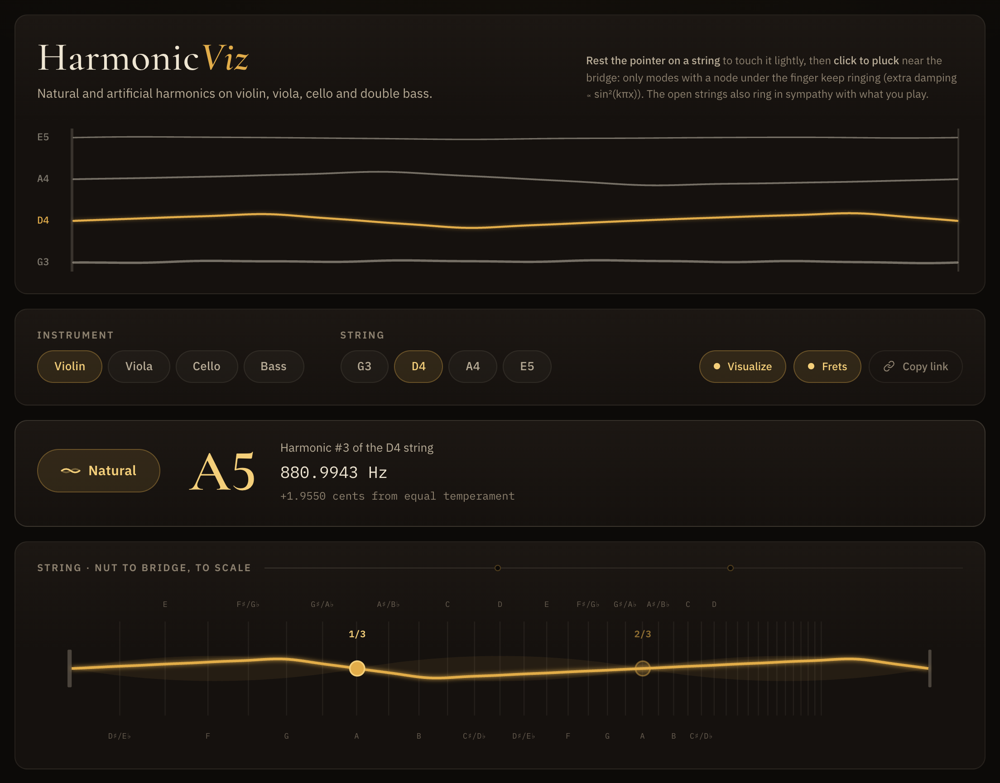
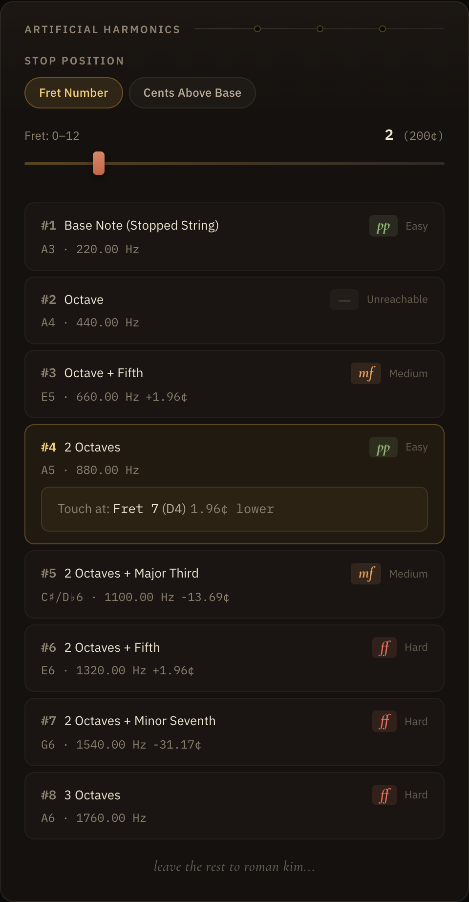
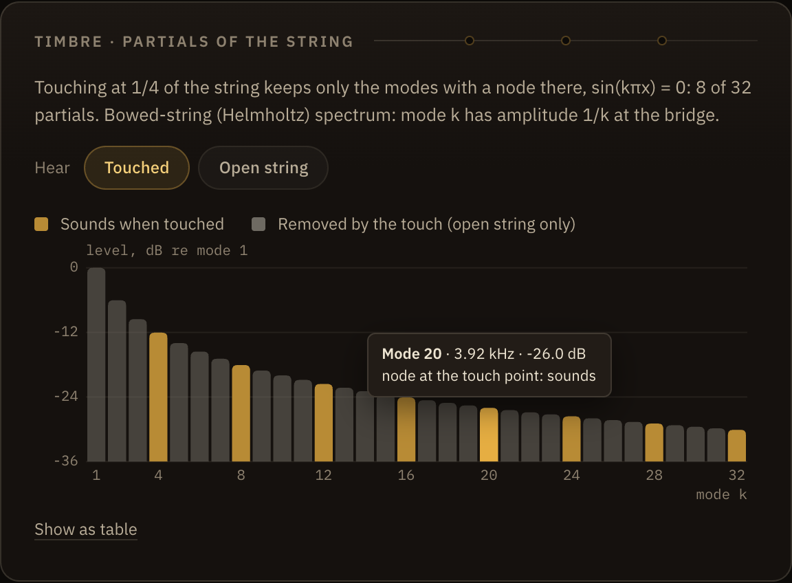
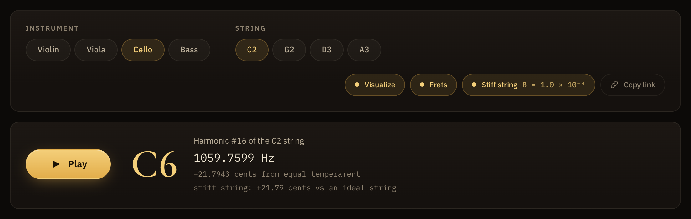
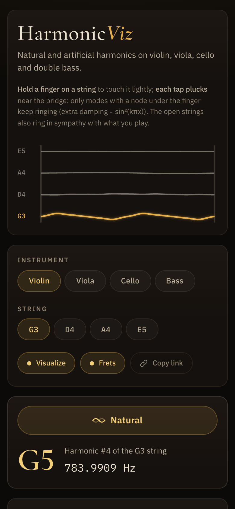

# HarmonicViz

An interactive guide to string harmonics for violin, viola, cello and double bass. Pick a string and a harmonic, and it shows where to touch the string, how far that point is from the nearest semitone position (in cents), and the pitch that sounds. It plays a modelled bowed-string tone, charts which partials survive the touch, and draws the string's motion as the sum of those partials.

**Live app:** https://mzhao1599.github.io/harmonicviz/

<p align="center">
  
</p>

## Why

Harmonics are hard to learn from a chart. The touch point for a natural harmonic sits at a simple fraction of the string (1/2, 1/3, 1/4, ...), but those points do not line up with where the fingers normally go, and some are a few cents away from a normal note position. Artificial harmonics add a second step: stop the string with one finger, then lightly touch a node of the *shortened* string with another. HarmonicViz draws all of this to scale, plays it, and shows why it works: a light touch lets through only the vibration modes that have a node under the finger.

## What it does

- **Instruments and strings.** Violin (G3 D4 A4 E5), viola (C3 G3 D4 A4), cello (C2 G2 D3 A3) and double bass (E1 A1 D2 G2), tuned in equal temperament from A4 = 440 Hz.
- **Natural harmonics #1–#16.** For each one: the interval above the open string ("2 Octaves + Major Third"), the sounding note and frequency, a rough difficulty rating (shown as *pp*, *mf* or *ff*), and every touch point that produces that harmonic. Choosing a touch point shows the nearest semitone position and how many cents higher or lower the true node is.
- **Artificial harmonics.** A slider sets where the lower finger stops the string (semitone positions 0–12, or any point from 0 to 1200 cents). The app lists harmonics #1–#8 of the stopped note and where to touch for each. #4 is the usual "touch a fourth above" harmonic (two octaves up) and #3 is "touch a fifth above".
- **Bowed-string sound.** Play sounds the harmonic as a sum of the string's modes, not a sine. A **Hear: Touched / Open string** switch (**Stopped, no touch** for artificial harmonics) plays the same string without the touch, for comparison.
- **Timbre chart.** One bar per mode, gold where the mode survives the touch and grey where the touch removes it, with a tooltip per bar and a table view.
- **The string in motion.** An SVG of the string drawn to scale, with semitone positions marked, clickable harmonic nodes, and the actual motion of the sounding modes. In artificial mode only the part between the stopping finger and the bridge vibrates.
- **Stiff strings (cello and bass).** An optional model of bending stiffness that makes the higher harmonics sharp.
- **Shareable links.** The URL always describes the current view, and **Copy link** copies it.
- **Playable header.** The instrument's four open strings, simulated mode by mode. Rest the pointer on a string to touch it lightly and click to pluck. They also ring in sympathy with whatever the app is playing.

<p align="center">
  
</p>

<p align="center">
  
  
</p>

## The math

Everything comes from a string of length *L* whose open pitch is *f₀*. Positions *x* are fractions of the length, measured from the nut.

### Where to touch

| Quantity | Formula | Code |
|---|---|---|
| Open-string pitch | f₀ = 440 · 2^(semitones from A4 / 12) | `noteToFrequency` in [`src/lib/music.ts`](src/lib/music.ts) |
| Natural harmonic *n* | fₙ = n · f₀ | `src/App.tsx` |
| Touch points for harmonic *n* | x = i/n for every i < n with gcd(i, n) = 1 | `naturalTouchPoints` |
| Semitone position *k* | x_k = 1 − 2^(−k/12) | `semitonePosition` |
| Offset from semitone position *k* | 1200 · log₂((1 − x_k) / (1 − x)) cents | `nearestSemitone` |
| Stopped note, *c* cents above open | f_s = f₀ · 2^(c/1200), stopped at x_s = 1 − 2^(−c/1200) | `artificialHarmonics`, `centsToPosition` |
| Artificial touch point for harmonic *n* | x_s + (1 − x_s)/n, sounding n · f_s | `artificialTouchPosition` |

The gcd filter matters: touching at 2/4 of the string gives the 2nd harmonic, not the 4th, so each harmonic lists only the fractions in lowest terms. Some values the tests check:

- On the violin G string, the 1/4 node is **1.96 cents below** the 5th semitone position (C4).
- On any string, the 5th harmonic (a pure major third, two octaves up) sounds **13.69 cents below** its equal-tempered note.
- The violin G string stopped at the 2nd semitone position (A3), touched for harmonic #4, sounds **880 Hz** (A5), with the touch 1.96 cents below the 7th semitone position (D4).

### Sound: which modes survive the touch

The string vibrates as a sum of normal modes k = 1, 2, 3, ... Mode *k* has shape sin(kπx) and frequency k · f₀. The code is in [`src/lib/timbre.ts`](src/lib/timbre.ts).

| Quantity | Formula | Code |
|---|---|---|
| Modes used | k = 1..32, below 16 kHz | `MAX_MODES`, `MAX_PARTIAL_FREQ` |
| A light touch at *x* keeps mode *k* when | \|sin(kπx)\| < 10⁻⁹, i.e. the mode has a node at *x* | `hasNodeAt`, `stringModes` |
| Bowed-string (Helmholtz) displacement of mode *k* | a_k = 1/k² | `helmholtzDisplacement` |
| Force on the bridge (what you hear) | k · a_k = 1/k, a sawtooth | `helmholtzBridgeForce` |
| Level in the chart | 20 · log₁₀(1/k) dB relative to mode 1 | `levelDb` |

Touching at i/n (in lowest terms) keeps modes n, 2n, 3n, ..., so the lowest surviving mode is harmonic *n* itself. For an artificial harmonic the same rule is applied to the vibrating length between the stopping finger and the bridge, with the touch at 1/n of that length. The sounding partials are scaled to the same RMS level as a unit sine (`partialAmplitudes`), so a touched harmonic is as loud as the open string.

### Drawing the motion

The string is drawn as

  y(x, t) = Σ a_k · sin(kπx) · sin(2π f_k t)

over the modes you hear (`displacement`). With every mode this is Helmholtz motion, a single corner running round a parallelogram-shaped envelope. With only multiples of *n* it is *n* copies of that motion, one per segment, standing still at the nodes. Time is slowed by a single common factor, so the lowest sounding mode completes 0.75 cycles per second and every frequency ratio stays true. A faint band shows the envelope (`displacementEnvelope`).

### Stiff strings

With **Stiff string** on (cello and bass), the strings get bending stiffness:

  f_k = k · f₀ · √(1 + B·k²),  B = 1.0 × 10⁻⁴

B is an illustrative value, not a measurement: real values depend on the string's core, winding, tension and length (for comparison, piano bass strings are around 2 × 10⁻⁴). The open string stays in tune, so f₀ = f_open / √(1 + B). Stopping the string shortens it to 1 − x_s, which gives f₀ / (1 − x_s) and B / (1 − x_s)², since B scales as 1/L². Mode shapes stay sin(kπx), so **the touch points do not move**, but every harmonic above the first comes out sharp by 600 · log₂((1 + B·n²)/(1 + B)) cents: +1.30 cents for #4 and +21.79 cents for #16 on an open string. With the toggle off every number is the ideal-string value. Code: `modeFrequency`, `vibratingLength`, `harmonicFrequency`, `inharmonicityCents`.

<p align="center">
  
</p>

<p align="center">
  
</p>

### The header strings

The header simulates the four open strings of the chosen instrument ([`src/lib/stringSim.ts`](src/lib/stringSim.ts)). Each string has 24 modes, each a damped oscillator

  q_k″ = −ω_k² q_k − 2γ_k q_k′ + F_k(t)

integrated in slowed-down time: the lowest string's fundamental runs at 0.9 Hz and the others in proportion to their pitch. Base damping is γ_k = 0.4 · (1 + 0.08k).

- **Pointer = light finger.** A finger at *x* adds ζ · ω_k · sin²(kπx) of damping with ζ = 0.9, a fraction of critical damping. A mode with a node under the finger loses nothing.
- **Click = pluck.** A click plucks at 0.88 of the length (near the bridge), adding the Fourier coefficients of a triangle, 2h · sin(kπβ) / (k²π² β(1 − β)). Rest the pointer at 1/3 and click, and harmonic #3 is what remains. A hint names the harmonic when the pointer sits on a node, and clicking a string also selects it.
- **Sympathetic resonance.** While the app plays, mode *k* of each string is driven by every sounding partial through a Lorentzian of half-width 4 cents around k · f. Playing the D string's 3rd harmonic (880.99 Hz) makes the A string ring in its 2nd mode (880 Hz).
- **Intro and idle.** On load the strings are plucked from lowest to highest, 0.32 s apart (any key, scroll or tap skips this). At rest, modes 1–3 get faint random kicks.

The loop pauses when the header is off screen and caps the canvas at 2× device pixels.

## Shareable links

The query string mirrors the view, so any state can be linked:

| Example | Meaning |
|---|---|
| `?instrument=violin&string=G3&harmonic=4&touch=3` | natural harmonic #4, touched at 3/4 |
| `?instrument=violin&string=G3&fret=2&artificial=4` | stopped at semitone 2, artificial harmonic #4 |
| `?instrument=bass&string=E1&cents=250&artificial=3` | stopped 250 cents up, artificial harmonic #3 |
| `...&stiff=1` | stiff-string model (cello and bass only) |

Missing or invalid values fall back to the defaults, and a touch point must be in lowest terms (`touch=2` with `harmonic=4` is ignored). See [`src/lib/urlState.ts`](src/lib/urlState.ts).

## Accessibility and phones

- Everything is a real button, so it works from the keyboard. The nodes on the string diagram are focusable and respond to Enter and Space.
- Toggles expose `aria-pressed`, the sliders have value text, and the current pitch is announced.
- Under `prefers-reduced-motion` the string drawing, the header and the small animations each show one still frame.
- On narrow screens the string diagram scrolls sideways instead of shrinking its labels, and the header's instructions change for touch ("Hold a finger on a string ... each tap plucks").

<p align="center">
  
</p>

## How it is built

- **React 19 + TypeScript + Vite 7.** The math is pure TypeScript in `src/lib/` (no React, no DOM): `music.ts`, `timbre.ts`, `urlState.ts` and `stringSim.ts`, each with Vitest tests next to it. [`src/App.tsx`](src/App.tsx) holds the state and composes the components in `src/components/`.
- **Rendering.** SVG for the string diagram and the timbre chart, with the moving string written straight into its path element from a `requestAnimationFrame` loop so the rest of the page does not re-render every frame. Canvas 2D for the header strings.
- **Audio.** The Web Audio API directly ([`src/audio/ToneEngine.ts`](src/audio/ToneEngine.ts)). One `AudioContext` lives for the whole page. Each sound is a bank of sine `OscillatorNode`s, one per partial, summed into a voice gain that fades in over 30 ms and out over 60 ms. Changing notes crossfades between voices, so nothing clicks. No audio library.
- **CI.** [`.github/workflows/build.yml`](.github/workflows/build.yml) runs lint, the tests and the build on every push to `main` and on pull requests.
- **Deployment.** `npm run deploy` builds with `base: '/harmonicviz/'` and pushes `dist/` to the `gh-pages` branch, which GitHub Pages serves.

## Run it locally

Requires Node 20.19 or newer (Vite 7).

```bash
git clone https://github.com/mzhao1599/harmonicviz && cd harmonicviz
npm ci
npm run dev        # http://localhost:5173/harmonicviz/
npm test           # unit tests (Vitest)
npm run lint
npm run build      # type-check, then build into dist/
```

## Limitations

- **Ideal-string model.** The sound is the string's modes only: no instrument body, no bow noise, no vibrato.
- **The touch is an ideal filter.** Each mode is either kept or removed. A real finger damps modes by degrees, and a real harmonic keeps a little of the removed partials.
- **Illustrative stiffness.** The stiff-string B is illustrative and the same for every cello and bass string. Violin and viola have no stiffness option.
- **Uncoupled header modes.** The header strings are a visual model: their modes are uncoupled, the finger is modal damping rather than a constraint, and they ignore stiffness.
- **"Fret" means semitone position.** The marker lines are equal-tempered semitone positions. Bowed strings have no frets; the app says "fret" to mean "where that semitone is stopped".
- **One node per artificial harmonic.** For each artificial harmonic the app shows only the node nearest the stopping finger, which is the one players use.
- **Fixed difficulty ratings.** Difficulty ratings are fixed by harmonic number, not measured.
